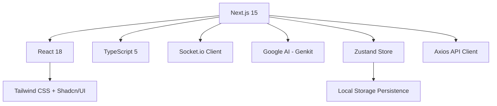

# 🚀 AetherConnect Frontend

[](https://nextjs.org/)
[](https://react.dev/)
[](https://www.typescriptlang.org/)
[](https://tailwindcss.com/)
[](https://zustand-demo.pmnd.rs/)
[](https://socket.io/)
[](https://firebase.google.com/products/genkit)

> **Enterprise-Grade Real-Time Chat Application** built with cutting-edge technologies and microservices architecture principles. Demonstrates advanced system design, scalability, and modern development practices.

## 🌟 Overview

AetherConnect is a sophisticated chat platform designed to showcase production-ready architecture patterns and advanced features. Built as a frontend demonstration of microservices integration, it features real-time messaging, AI-powered smart replies, and enterprise security standards.

### ✨ Key Highlights

- **🔐 Enterprise Security**: JWT/OAuth2 authentication with Firebase backend
- **⚡ Real-Time Messaging**: WebSocket-based communication with Socket.io
- **🤖 AI-Powered Features**: Smart reply suggestions using Google Gemini AI
- **🎨 Modern UI/UX**: Clean, responsive design with dark/light theme support
- **📊 Advanced State Management**: Zustand with local persistence
- **🏗️ Scalable Architecture**: Modular design with clear separation of concerns
- **🔧 Developer Experience**: Full TypeScript, ESLint, hot reloading

## 🏗️ Architecture

### Technical Stack



### Core Features

- **Authentication System**
  - Secure login/signup with JWT tokens
  - Session management with custom events
  - Automatic token refresh and error handling

- **Real-Time Chat**
  - WebSocket connections with Socket.io
  - Typing indicators and presence detection
  - Message history with pagination
  - Support for text messages and rich media

- **AI Integration**
  - Smart reply suggestions powered by Google Gemini
  - Context-aware response generation
  - Server-side AI processing via API routes

- **State Management**
  - Centralized state with Zustand
  - Persistent auth and room data
  - Optimistic updates and error recovery

## 🚀 Quick Start

### Prerequisites

- Node.js 18+ and npm
- Git
- Backend API (refer to backend repository)

### Installation

```bash
# Clone the repository
git clone https://github.com/codes71/AetherConnect-Frontend.git
cd AetherConnect-Frontend

# Install dependencies
npm install

# Set up environment variables
cp .env.example .env.local
# Edit .env.local with your configuration
```

### Development

```bash
# Start development server
npm run dev

# Start AI development server (separate terminal)
npm run genkit:dev

# Run linting
npm run lint

# Type checking
npm run typecheck

# Build for production
npm run build

# Start production server
npm run start
```

### Environment Configuration

Create `.env.local` with:

```env
NEXT_PUBLIC_API_URL=http://localhost:3001/api
NEXT_PUBLIC_WS_URL=http://localhost:3001
NEXT_PUBLIC_GOOGLE_AI_API_KEY=your_google_ai_key
NEXT_PUBLIC_FIREBASE_CONFIG=your_firebase_config
```

## 📁 Project Structure

```
AetherConnect-Frontend/
├── src/
│   ├── app/                    # Next.js App Router pages
│   │   ├── (auth)/            # Authentication routes
│   │   ├── chat/              # Main chat interface
│   │   ├── api/               # API routes (smart-replies)
│   │   └── globals.css        # Global styles
│   ├── components/            # Reusable UI components
│   │   ├── ui/               # Radix UI primitives
│   │   ├── chat/             # Chat-specific components
│   │   └── auth/             # Authentication components
│   ├── store/                # Zustand state stores
│   │   ├── authStore.ts      # Authentication state
│   │   └── appStore.ts       # Application state
│   ├── context/              # React contexts
│   │   ├── socket-context.tsx # WebSocket management
│   │   └── room-context.tsx   # Room/room selection
│   ├── hooks/                # Custom React hooks
│   │   ├── use-message-history.ts
│   │   └── use-socket.ts
│   ├── ai/                   # AI integration
│   │   ├── flows/           # Genkit AI flows
│   │   └── genkit.ts        # Genkit configuration
│   ├── api/                 # API client and helpers
│   ├── lib/                 # Utilities and types
│   └── middleware.ts        # Next.js middleware
├── public/                   # Static assets
├── docs/                     # Documentation
└── package.json
```

## 🎯 Key Features

### 🔐 Authentication & Security

- **JWT Authentication**: Secure token-based auth with automatic refresh
- **Role-Based Access**: User roles and permissions
- **Session Management**: Custom events for auth state changes
- **Error Handling**: Comprehensive error boundaries and recovery

### 💬 Real-Time Messaging

- **WebSocket Communication**: Low-latency real-time updates
- **Typing Indicators**: Live typing status for better UX
- **Message History**: Paginated message loading with scroll restoration
- **Multiple Room Types**: Support for DMs, group chats, and public rooms

### 🤖 AI-Powered Features

- **Smart Reply Suggestions**: Context-aware reply generation using Google Gemini
- **Intelligent Context Analysis**: Learns from conversation history
- **Server-Side Processing**: Privacy-focused AI integration

### 🎨 User Interface

- **Responsive Design**: Mobile-first approach with adaptive layouts
- **Theme Support**: Light/dark mode with system preference detection
- **Accessible Components**: WCAG-compliant UI with Radix primitives
- **Smooth Animations**: CSS transitions and micro-interactions

### 📊 State Management

- **Centralized Store**: Single source of truth with Zustand
- **Persistent State**: Local storage integration for offline capabilities
- **Optimistic Updates**: Immediate UI feedback with rollback on errors

## 🔧 Development Guide

### Code Quality

```bash
# Run all quality checks
npm run lint
npm run typecheck
npm run build

# Development workflow
npm run dev          # Start Next.js dev server
npm run genkit:dev   # Start AI development server
```

### Component Development

Components follow a consistent pattern:
- TypeScript interfaces for props
- Shadcn/UI components for consistency
- Custom hooks for logic separation
- Memoization for performance

### API Integration

- Centralized API client in `src/api/`
- Error handling via interceptors
- Type-safe API responses
- Loading states and error recovery

## 🧪 Testing Strategy

### Manual Testing Checklist

- ✅ Authentication flow (login/signup/logout)
- ✅ Room creation and navigation
- ✅ Real-time messaging functionality
- ✅ AI smart reply generation
- ✅ Theme switching
- ✅ Responsive design across devices

### Performance Optimization

- Component memoization with `React.memo`
- Lazy loading for routes
- Image optimization with Next.js Image
- Bundle analysis with `@next/bundle-analyzer`

## 📈 Performance Metrics

### Lighthouse Scores (Target)
- **Performance**: 90+
- **Accessibility**: 95+
- **Best Practices**: 95+
- **SEO**: 90+

### Bundle Size
- First load: <200KB gzipped
- Subsequent loads: <50KB gzipped

## 🤝 Contributing

### Development Workflow

1. **Fork and Clone**
   ```bash
   git clone https://github.com/your-username/AetherConnect-Frontend.git
   cd AetherConnect-Frontend
   ```

2. **Create Feature Branch**
   ```bash
   git checkout -b feature/your-feature-name
   ```

3. **Install Dependencies**
   ```bash
   npm install
   ```

4. **Make Changes**
   - Follow TypeScript best practices
   - Use conventional commit messages
   - Add tests for new features

5. **Testing**
   ```bash
   npm run lint
   npm run typecheck
   npm run build
   npm run dev
   ```

6. **Submit PR**
   - Ensure all checks pass
   - Provide clear description
   - Request review from maintainers

### Code Standards

- **TypeScript**: Strict mode enabled
- **ESLint**: Airbnb config with custom rules
- **Prettier**: Consistent code formatting
- **Commits**: Conventional commits (feat, fix, docs, style, refactor)

## 📚 Documentation

### API Reference

See [Backend API Docs](https://github.com/codes71/AetherConnect-Backend) for complete API documentation.

### Architecture Decisions

- **State Management**: Zustand over Redux for simplicity
- **UI Library**: Shadcn/UI for consistent, accessible components
- **Styling**: Tailwind CSS for utility-first approach
- **Real-time**: Socket.io for reliable WebSocket connections

### Troubleshooting

Common issues and solutions:
- **WebSocket connection fails**: Check WS_URL in environment
- **AI features not working**: Verify Google AI API key
- **Build fails**: Run `npm run typecheck` for TypeScript errors

## 🚀 Deployment

### Vercel (Recommended)

```bash
# Install Vercel CLI
npm i -g vercel

# Deploy
vercel

# Production build
npm run build
```

### Docker

```dockerfile
FROM node:18-alpine
WORKDIR /app
COPY package*.json ./
RUN npm ci --only=production
COPY . .
RUN npm run build
EXPOSE 3004
CMD ["npm", "start"]
```

### Environment Variables (Production)

```env
NODE_ENV=production
NEXT_PUBLIC_API_URL=https://api.your-domain.com
NEXT_PUBLIC_WS_URL=wss://ws.your-domain.com
NEXT_PUBLIC_GOOGLE_AI_API_KEY=your_production_key
```

## 📄 License

This project is licensed under the MIT License - see the [LICENSE](LICENSE) file for details.

## 🏆 Acknowledgments

- **Next.js Team** for the amazing React framework
- **Shadcn** for the beautiful UI components
- **Google AI** for the powerful Genkit platform
- **Socket.io** for reliable real-time communication
- **Tailwind CSS** for utility-first styling

## 📞 Support

For support, email support@aetherconnect.dev or join our Discord community.

---

**Built with ❤️ by the AetherConnect Team**

*Showcasing modern web development practices and enterprise-grade architecture patterns.*
